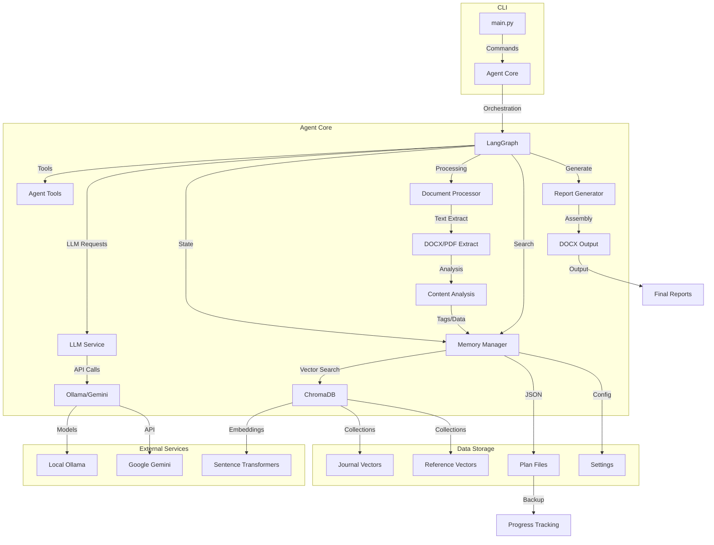

# Apprenticeship Report Agent (memoire-agent-V2)

This AI agent aims to automate the creation of an MSc Apprenticeship Report ("Mission Professionnelle Digi5") using daily journal entries (DOCX) and official guidelines (PDF). It leverages local embeddings for context retrieval and a configurable LLM (Google Gemini API via LangChain or a local Ollama model) for reasoning, task execution, and content generation.

## Current Status & Features (Checkpoint: LangGraph Implemented - Holistic Analysis Failing)

*   ✅ **DOCX/PDF Processing:** Parses journals (YYYY-MM-DD.docx format) and guidelines PDF.
*   ✅ **Local Embeddings:** Uses local Sentence Transformers (`paraphrase-multilingual-mpnet-base-v2`) via ChromaDB. Data remains local during vectorization.
*   ✅ **Vector Storage:** Separate ChromaDB collections (`journal_entries`, `reference_docs`) persisted locally (`vector_db/`).
*   ✅ **Configurable LLM:** Supports **Google Gemini API** and **local Ollama models** (via `langchain-community`). Choice via `config.py` or `--llm` argument. (`llm_interface.py`). Currently testing with Ollama (`llama3.1:8b-instruct-q8_0`).
*   ✅ **Report Planning:** Command `create_plan` generates `output/report_plan.json` with unique section IDs and status tracking (`report_planner.py`, `memory_manager.py`).
*   ✅ **LangGraph Workflow (`run_agent`):** Agent logic refactored using **LangGraph** for explicit state management and control flow. The graph implements a **2-step writing process** (Analyze/Structure -> Write Prose) per section.
*   ✅ **Core Tools:** Base tools for getting pending sections and updating status (`GetPendingSectionsTool`, `UpdateSectionStatusTool`) are functional within the graph. Vector search tools are used internally by graph nodes.
*   ✅ **Guardrails (Basic):** Post-processing node includes Python code for basic anonymization enforcement.
*   ✅ **Report Assembly:** Command `assemble_report` generates DOCX from the completed plan JSON.
*   🔴 **BLOCKING ISSUE:** The **`analyze_journals` command FAILS** to produce reliable, clean JSON output. The Ollama LLM (`llama3.1:8b-instruct-q8_0`), despite a detailed prompt requesting strict JSON format between delimiters, often includes conversational text, causing `json.loads()` to fail. Robust extraction logic (regex between delimiters) was added but also failed in the last test, likely because the LLM didn't use the delimiters correctly or the JSON itself was malformed. The raw LLM output is saved to `output/holistic_analysis_raw.txt`.
*   ⚠️ **Untested Workflow:** Due to the failure of `analyze_journals`, the main `run_agent` workflow (which depends on the holistic analysis JSON) has not been successfully tested with the new 2-step writing logic.
*   ⚠️ **Content Quality (Anticipated):** Previous tests with simpler prompts showed mediocre content quality from the local LLM. Significant improvements are needed via better analysis, prompting, and potentially critique loops.



## Structure détaillée 
```
memoire-agent/
├── backend/                     # Non implémenté (structure future)
│   ├── api/                     # Définitions API FastAPI (futur)
│   │   ├── dependencies.py      # Dépendances FastAPI
│   │   ├── hallucination.py     # Fonctions pour la détection d'hallucinations
│   │   └── models/              # Modèles Pydantic pour API
│   │       ├── admin.py         # Modèles admin et maintenance
│   │       ├── ai.py            # Modèles pour l'IA et génération
│   │       ├── base.py          # Modèles de base partagés
│   │       ├── export.py        # Modèles d'exportation
│   │       ├── hallucination.py # Modèles détection d'hallucinations
│   │       ├── journal.py       # Modèles pour journal de bord
│   │       └── memoire.py       # Modèles pour sections du mémoire
│   ├── routes/                  # Endpoints API
│   │   ├── admin.py             # Routes administratives
│   │   ├── ai.py                # Routes IA et génération
│   │   ├── export.py            # Routes d'exportation
│   │   ├── hallucination.py     # Routes détection d'hallucinations
│   │   ├── journal.py           # Routes pour journal de bord
│   │   ├── memoire.py           # Routes pour le mémoire
│   │   └── search.py            # Routes de recherche
│   └── utils/                   # Utilitaires API
│       └── text_analysis.py     # Analyse des textes API
│
├── core/                        # Composants centraux
│   ├── config.py                # Configuration application
│   ├── dummy_vectordb.py        # Fallback ChromaDB
│   ├── exceptions.py            # Exceptions personnalisées
│   ├── logging.py               # Configuration logs centrale
│   ├── logging_config.py        # Configuration logs avancée
│   └── memory_manager.py        # Gestion de la mémoire vectorielle
│
├── data/                        # Données persistantes
│   ├── memoire.db               # Base de données SQLite
│   └── vectordb/                # Données vectorielles (ChromaDB)
│
├── db/                          # Couche d'accès aux données
│   ├── database.py              # Gestionnaire de connexion BD
│   ├── models/                  # Modèles de données
│   │   └── db_models.py         # Définitions des modèles SQL
│   └── repositories/            # Repositories (pattern DAO)
│       ├── guidelines_repository.py    # Repository pour consignes
│       ├── journal_repository.py       # Repository pour journal
│       └── memoire_repository.py       # Repository pour mémoire
│
├── journals/                    # Dossier des journaux DOCX (entrée utilisateur)
│   └── [YYYY-MM-DD.docx]        # Fichiers journaux au format date
│
├── output/                      # Fichiers de sortie générés
│   ├── holistic_analysis.json   # Analyse holistique des journaux
│   ├── holistic_analysis_raw.txt # Sortie brute LLM (debug)
│   ├── report_plan.json         # Plan structuré du rapport
│   └── apprenticeship_report.docx # Rapport final généré
│
├── logs/                        # Journaux application backend
│
├── schemas/                     # Schémas JSON pour communication
│   ├── action_confirmation_request_schema.json
│   ├── action_confirmation_response_schema.json
│   ├── data_analysis_request_schema.json
│   ├── data_analysis_response_schema.json
│   ├── report_generation_request_schema.json
│   ├── report_generation_response_schema.json
│   ├── report_plan_change_notification_schema.json
│   ├── report_plan_retrieval_request_schema.json
│   ├── report_plan_retrieval_response_schema.json
│   ├── report_plan_update_confirmation_schema.json
│   ├── report_plan_update_request_schema.json
│   ├── task_assignment_schema.json
│   ├── task_completion_notification_schema.json
│   ├── user_input_request_schema.json
│   └── user_input_response_schema.json
│
├── services/                    # Services métier (futur backend)
│
├── scripts/                     # Scripts utilitaires
│   ├── init.sh                  # Initialisation environnement
│   └── run_tests.sh             # Exécution des tests
│
├── vector_db/                   # Base de données vectorielle (ChromaDB)
│   ├── [journal_entries]/       # Collection des journaux vectorisés
│   └── [reference_docs]/        # Collection des documents de référence
│
├── .github/workflows/           # CI/CD Pipeline
│   └── main.yml                 # Workflow GitHub Actions
│
├── .gitignore                   # Fichiers ignorés par Git
├── LICENSE                      # Licence MIT
├── README.md                    # Documentation principale
├── requirements.txt             # Dépendances Python
│
# === MODULES PYTHON PRINCIPAUX ===
├── main.py                      # Point d'entrée principal - CLI & LangGraph workflow
├── agent_tools.py               # Outils pour l'agent LangGraph
├── competency_mapper.py         # Mapping des compétences (LLM)
├── content_analyzer.py          # Analyse de contenu (LLM)
├── data_models.py               # Modèles Pydantic (JournalEntry, ReportPlan, etc.)
├── document_processor.py        # Traitement DOCX/PDF
├── llm_interface.py             # Interface unifiée LLM (Ollama/Google)
├── memory_manager.py            # Gestionnaire d'état et persistance JSON
├── progress_tracker.py          # Suivi de progression du rapport
├── quality_checker.py           # Vérification qualité (LLM)
├── reference_manager.py         # Gestion bibliographie Harvard
├── rename_journals.py           # Script de renommage des journaux
├── report_generator.py          # Génération rapport final + assemblage
├── report_planner.py            # Création plan de rapport structuré
├── tag_generator.py             # Génération de tags (LLM)
├── vector_database.py           # Gestionnaire ChromaDB avec embeddings locaux
└── visualization.py             # Visualisations matplotlib
```

## Revised Roadmap: Stabilize Analysis, Enhance Quality, Implement Control
**Goal:** Achieve reliable autonomous report generation using a local LLM, produce high-quality, personalized, and anonymized content in French, and add advanced features.

**Immediate Priority: Fix Holistic Analysis JSON Generation**
1.  [ ] **Evaluate Raw Analysis Output:** Manually review the content of `output/holistic_analysis_raw.txt`. Is the *information* extracted by the LLM (despite formatting issues) relevant and accurate according to the journals?
2.  [ ] **Implement Robust Parsing/Correction OR Refine Prompt/Model:**
    *   **If Content OK:** Implement robust LangChain parsers (`PydanticOutputParser`, `StructuredOutputParser`) possibly combined with `OutputFixingParser` within the `run_holistic_analysis` function in `main.py` to reliably extract the JSON even from "chatty" LLM output.
    *   **If Content BAD:** Re-design the holistic analysis prompt in `run_holistic_analysis` significantly OR test a different Ollama model (e.g., `mixtral:instruct`) specifically for this JSON extraction task.

**Iteration 2: First End-to-End Test & Quality Baseline** (Requires Fix above)
3.  [ ] **Run Full Workflow (Limited Sections):** Execute `python main.py run_agent --llm ollama --max_iterations 3` after `analyze_journals` is fixed.
4.  [ ] **Assess Baseline Quality:** Evaluate the generated content for the first few sections based on the 2-step process (relevance, analysis depth, anonymization, neutrality, style).
5.  [ ] **Refine Analysis & Writing Prompts:** Iterate on the prompts within the LangGraph nodes (`structure_section_content`, `write_section_prose` in `main.py`) based on the quality assessment.

**Iteration 3: Epitech Alignment, Critique Loop & Control**
6.  [ ] **Focus Epitech Guidelines:** Ensure prompts explicitly use structured guidelines from `config.py`. Align `DEFAULT_REPORT_STRUCTURE`.
7.  [ ] **Implement Critique Loop:** Add a `critique_section` node in LangGraph using an LLM call to evaluate generated sections against guidelines and quality criteria. Add conditional logic to revise or mark as 'failed'.
8.  [ ] **Basic Agent Control:** Implement simple `Go`/`Stop` functionality (likely requires running the LangGraph invoke in a separate thread/process). Add `GetAgentStatusTool`.
9.  [ ] **Setup CI/CD Pipeline (GitHub Actions).**

**Iteration 4 & Beyond: Advanced Features**
10. [ ] **Human-in-the-Loop (HITL):** Add wait points in LangGraph for user validation/correction.
11. [ ] **Web Search Integration.**
12. [ ] **Bibliography Management.**
13. [ ] **Explore GraphRAG** if vector RAG proves insufficient for deep analysis.
14. [ ] **Refine UI/Interaction.**

## Setup (Local Conda Environment)
... (Setup instructions remain largely the same as V3, ensure Ollama + chosen model are installed) ...

## Usage
*   **Analyze Journals (Run First):** `python main.py analyze_journals [--llm ollama/google]`
*   **Create/Reset Plan:** `python main.py create_plan`
*   **Run Agent Workflow:** (Set env vars if needed) `python main.py run_agent --llm ollama [--max_iterations N]`
*   **Assemble Report:** `python main.py assemble_report [--plan_file <path>] [--output_file <path>]`
*   **(Other):** `process_guidelines`, `check_quality`, `create_visuals`, `manage_refs`
